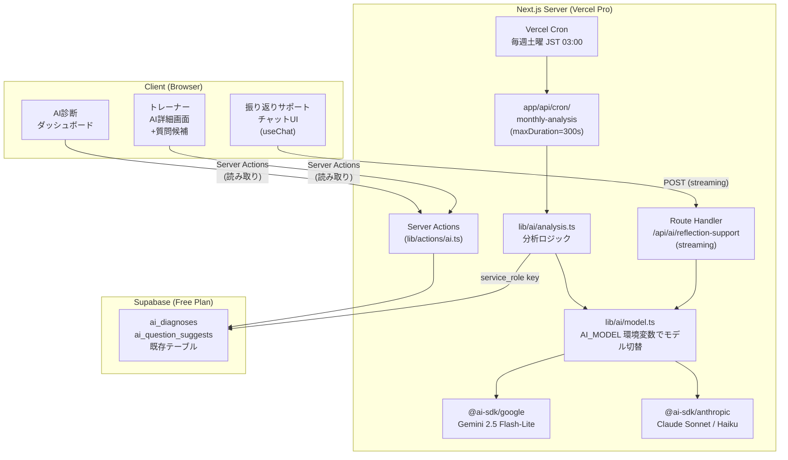
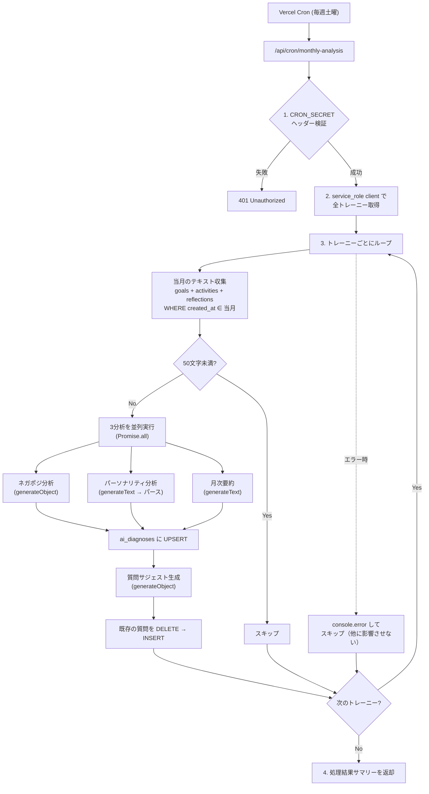
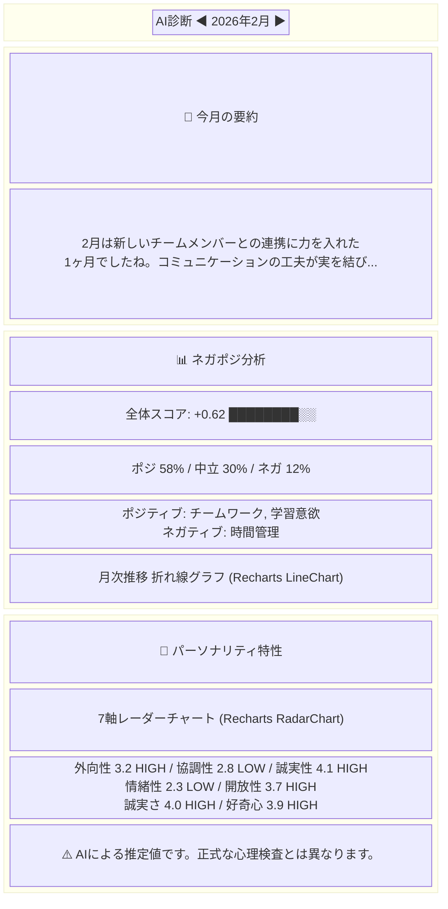
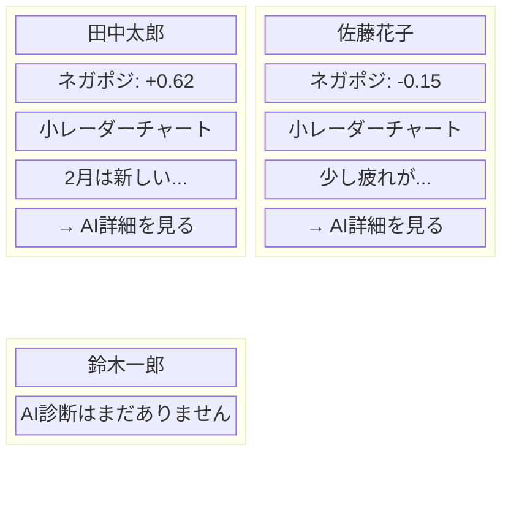
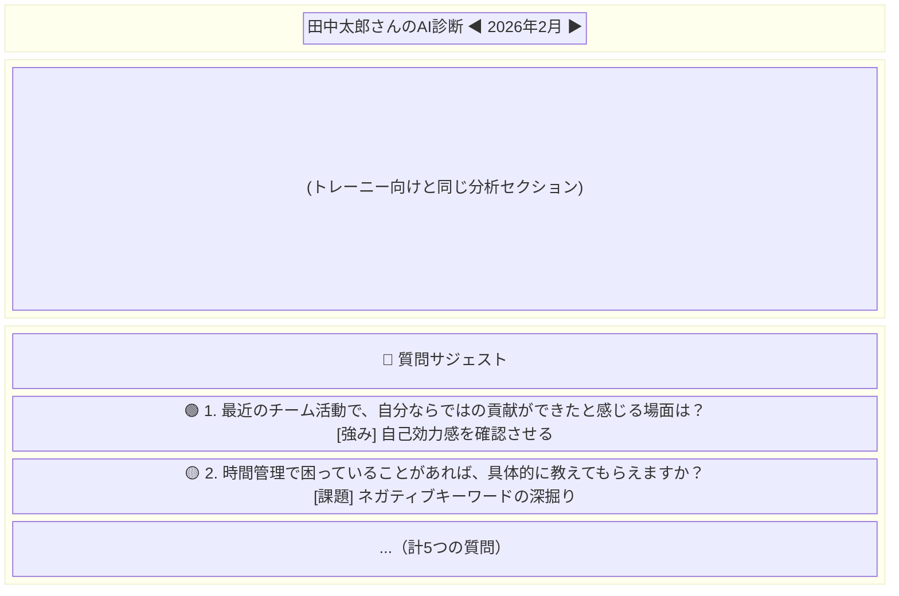
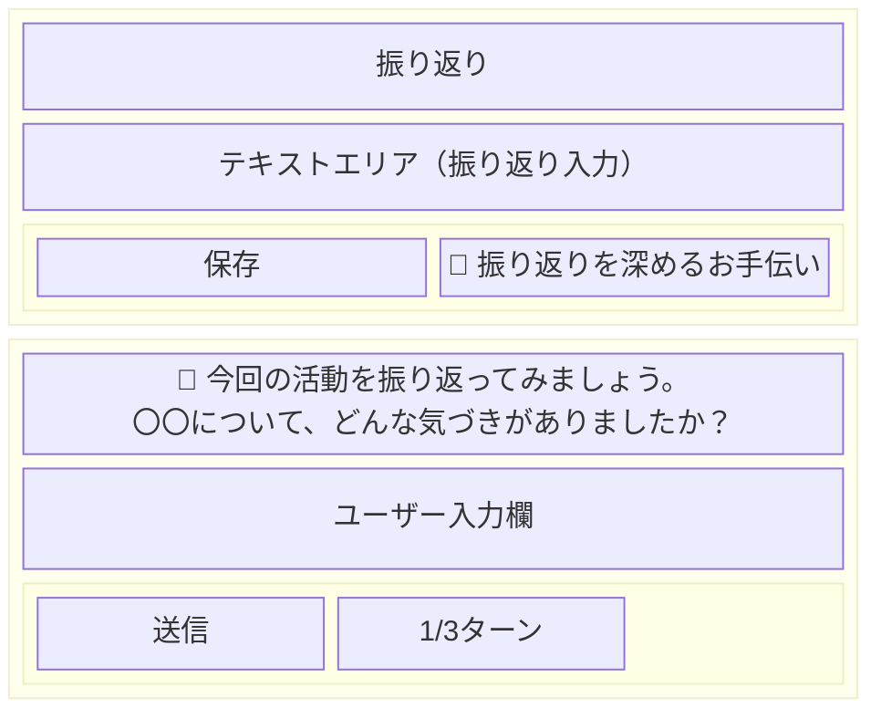
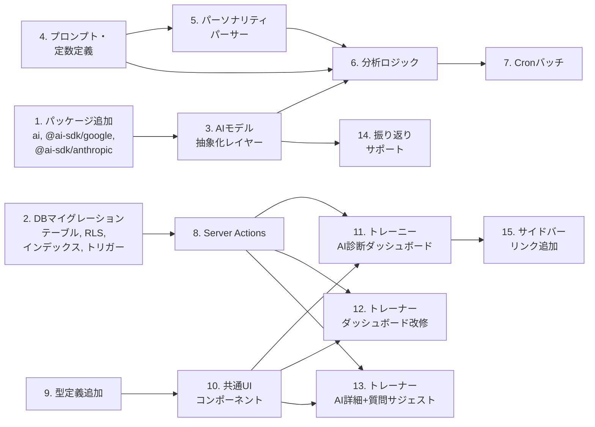

# Hisoka AI機能 設計書

---

## 1. アーキテクチャ概要



---

## 2. 技術的前提・制約

| 項目 | 内容 |
|------|------|
| Vercel | Pro プラン（Serverless 最大300s、Cron Jobs 利用可能） |
| Supabase | Free プラン（500MB DB、50,000 MAU） |
| 初期AIモデル | Gemini 2.5 Flash-Lite（`@ai-sdk/google`） |
| スケジューラ | Vercel Cron Jobs（Proに含まれるため追加コスト不要） |
| ストリーミング | Vercel AI SDK `streamText` + `useChat` |

### バッチ処理のスループット見積もり

1人あたりのAI呼び出し: 4回（ネガポジ・パーソナリティ・要約・質問サジェスト）
- 3分析は並列実行可能 → 実効 2回分の待ち時間
- Gemini Flash-Lite 想定レイテンシ: 3〜5秒/回
- 1人あたり: 約10秒
- 300秒制限 → **1回の実行で約25〜30人**を処理可能

30人を超える場合は、Cron実行を複数日に分散するか、処理済みフラグで続きから実行する設計とする（後述）。

---

## 3. データベース設計

### 3.1 テーブル定義

#### ai_diagnoses（月次AI診断結果）

```sql
CREATE TABLE ai_diagnoses (
  id UUID PRIMARY KEY DEFAULT uuid_generate_v4(),
  user_id UUID NOT NULL REFERENCES users(id) ON DELETE CASCADE,
  year INTEGER NOT NULL,
  month INTEGER NOT NULL CHECK (month BETWEEN 1 AND 12),

  -- ネガポジ分析
  sentiment_score DECIMAL(4,2) NOT NULL,           -- -1.00 〜 1.00
  sentiment_positive_ratio DECIMAL(3,2) NOT NULL,  -- 0.00 〜 1.00
  sentiment_negative_ratio DECIMAL(3,2) NOT NULL,
  sentiment_neutral_ratio DECIMAL(3,2) NOT NULL,
  sentiment_positive_keywords TEXT[] DEFAULT '{}',
  sentiment_negative_keywords TEXT[] DEFAULT '{}',
  sentiment_trend VARCHAR(20) DEFAULT 'stable'
    CHECK (sentiment_trend IN ('improving', 'stable', 'declining')),

  -- パーソナリティ分析（60問の生スコア）
  personality_raw_scores JSONB NOT NULL,
  -- 例: {"1":3,"2":4,...,"60":2}

  -- 7特性の集計結果
  personality_traits JSONB NOT NULL,
  -- 例: {
  --   "extraversion":       {"score": 3.2, "level": "HIGH"},
  --   "agreeableness":      {"score": 2.8, "level": "LOW"},
  --   "conscientiousness":  {"score": 4.1, "level": "HIGH"},
  --   "emotionality":       {"score": 2.3, "level": "LOW"},
  --   "openness":           {"score": 3.7, "level": "HIGH"},
  --   "honesty_humility":   {"score": 4.0, "level": "HIGH"},
  --   "curiosity":          {"score": 3.9, "level": "HIGH"}
  -- }

  -- 月次要約
  summary TEXT NOT NULL,

  -- メタデータ
  source_text_length INTEGER NOT NULL DEFAULT 0,
  analyzed_at TIMESTAMPTZ DEFAULT NOW(),
  created_at TIMESTAMPTZ DEFAULT NOW(),
  updated_at TIMESTAMPTZ DEFAULT NOW(),

  UNIQUE(user_id, year, month)
);

CREATE INDEX idx_ai_diagnoses_user_id ON ai_diagnoses(user_id);
CREATE INDEX idx_ai_diagnoses_year_month ON ai_diagnoses(year, month);
```

#### ai_question_suggests（質問サジェスト）

```sql
CREATE TABLE ai_question_suggests (
  id UUID PRIMARY KEY DEFAULT uuid_generate_v4(),
  diagnosis_id UUID NOT NULL REFERENCES ai_diagnoses(id) ON DELETE CASCADE,
  question TEXT NOT NULL,
  category VARCHAR(20) NOT NULL
    CHECK (category IN ('growth', 'challenge', 'strength', 'emotion', 'next_step')),
  intent TEXT NOT NULL,
  priority INTEGER NOT NULL CHECK (priority BETWEEN 1 AND 5),
  created_at TIMESTAMPTZ DEFAULT NOW()
);

CREATE INDEX idx_ai_question_suggests_diagnosis_id
  ON ai_question_suggests(diagnosis_id);
```

#### 振り返りサポートの会話ログ

会話ログは**保存しない**。理由:
- 最大3ターンの短い対話であり、価値は振り返りテキスト本体に集約される
- Supabase Free プランのストレージを節約する
- ユーザーは対話を参考にして自分で振り返りテキストを編集・保存する

### 3.2 RLS ポリシー

既存の `is_trainer_of()` 関数を再利用する。

```sql
ALTER TABLE ai_diagnoses ENABLE ROW LEVEL SECURITY;
ALTER TABLE ai_question_suggests ENABLE ROW LEVEL SECURITY;

-- ai_diagnoses: トレーニーは自分のデータのみ
CREATE POLICY "Users can view own diagnoses" ON ai_diagnoses
  FOR SELECT USING (auth.uid() = user_id);

-- ai_diagnoses: トレーナーは担当トレーニーのデータ
CREATE POLICY "Trainers can view assigned trainee diagnoses" ON ai_diagnoses
  FOR SELECT USING (public.is_trainer_of(user_id));

-- ai_question_suggests: トレーナーのみ閲覧可能
CREATE POLICY "Trainers can view question suggests" ON ai_question_suggests
  FOR SELECT USING (
    EXISTS (
      SELECT 1 FROM ai_diagnoses d
      WHERE d.id = ai_question_suggests.diagnosis_id
        AND public.is_trainer_of(d.user_id)
    )
  );

-- Cron バッチ用: service_role で実行するため RLS をバイパス
-- （追加ポリシー不要。service_role client は RLS を無視する）
```

### 3.3 updated_at トリガー

```sql
CREATE TRIGGER update_ai_diagnoses_updated_at
  BEFORE UPDATE ON ai_diagnoses
  FOR EACH ROW EXECUTE FUNCTION update_updated_at_column();
```

---

## 4. AIモデル抽象化レイヤー

### 4.1 環境変数

```
AI_MODEL=google:gemini-2.5-flash-lite
```

フォーマット: `{provider}:{model-id}`

| provider | パッケージ | model-id 例 |
|----------|-----------|-------------|
| `google` | `@ai-sdk/google` | `gemini-2.5-flash-lite` |
| `anthropic` | `@ai-sdk/anthropic` | `claude-sonnet-4-6` |

### 4.2 実装: `lib/ai/model.ts`

```typescript
import { google } from '@ai-sdk/google';
import { anthropic } from '@ai-sdk/anthropic';

export function getModel() {
  const key = process.env.AI_MODEL || 'google:gemini-2.5-flash-lite';
  const colonIndex = key.indexOf(':');

  if (colonIndex === -1) {
    throw new Error(`AI_MODEL の形式が不正です: "${key}" (期待: "provider:model-id")`);
  }

  const provider = key.slice(0, colonIndex);
  const modelId = key.slice(colonIndex + 1);

  switch (provider) {
    case 'google':
      return google(modelId);
    case 'anthropic':
      return anthropic(modelId);
    default:
      throw new Error(`未対応のAIプロバイダ: "${provider}"`);
  }
}
```

---

## 5. バッチ分析（月次診断）

### 5.1 Vercel Cron 設定

`vercel.json`（新規作成）:

```json
{
  "crons": [
    {
      "path": "/api/cron/monthly-analysis",
      "schedule": "0 18 * * 6"
    }
  ]
}
```

> `0 18 * * 6` = 毎週土曜 UTC 18:00 = JST 日曜 03:00

### 5.2 処理フロー



### 5.3 テキスト収集クエリ

```typescript
// service_role client で RLS バイパス
const { data } = await adminClient
  .from('goals')
  .select(`
    content,
    activities (
      content,
      reflections ( content )
    )
  `)
  .eq('user_id', traineeId)
  .gte('created_at', monthStart)
  .lt('created_at', nextMonthStart);
```

収集したテキストをすべて結合し、`{TEXT}` プレースホルダーに挿入する。

### 5.4 トレンド算出

前月の `ai_diagnoses` を取得し、`sentiment_score` を比較:

| 条件 | トレンド |
|------|---------|
| 今月 - 前月 > 0.1 | `improving` |
| 今月 - 前月 < -0.1 | `declining` |
| それ以外 | `stable` |
| 前月データなし | `stable` |

### 5.5 スケール対応（30人超）

処理対象のトレーニーが多い場合に備え、以下の仕組みを入れる:

1. `ai_diagnoses` の `analyzed_at` を確認し、今週すでに分析済みのトレーニーはスキップ
2. 残り時間が30秒を切ったら処理を中断し、次回実行で続きを処理
3. 中断時はレスポンスに `{ partial: true, processed: N, remaining: M }` を返す

---

## 6. プロンプト設計

### 6.1 パーソナリティ特性分析（固定・変更不可）

要件定義書セクション6のプロンプトをそのまま使用する。`generateText` でテキスト応答を取得し、正規表現でパースする。

**パーサー仕様:**

```
入力: AIの応答テキスト
出力: {
  scores: Record<number, number>,  // {1: 3, 2: 4, ..., 60: 2}
  traits: Record<string, 'HIGH' | 'LOW'>
}

パース手順:
1. /(\d+)\.\s*SCORE:\s*(\d)/g で 60問のスコアを抽出
2. /(誠実さ|情緒性|外向性|協調性|誠実性|開放性|好奇心).*?(HIGH|LOW)/g で特性を抽出
```

**逆転項目の処理（要件定義書の修正を含む）:**

> ※ 要件定義書の逆転項目リストにはQ32, Q51-53が含まれていなかったが、
> 設問内容から逆転処理が必要と判断し追加した。
> - Q32「大抵リラックスしている」→ 高スコア=低い情緒性のため逆転が必要
> - Q51-53 はすべて「誠実さが低い」方向の設問のため逆転が必要

```typescript
const REVERSE_ITEMS = [
  2, 4, 6, 8, 10,       // 外向性
  12, 14, 16, 18,        // 協調性
  22, 24, 26, 28,        // 誠実性
  32, 34, 39,            // 情緒性 ★Q32追加
  42, 44, 46,            // 開放性
  51, 52, 53,            // 誠実さ・謙虚さ ★Q51-53追加
];

function reverseScore(questionNum: number, rawScore: number): number {
  return REVERSE_ITEMS.includes(questionNum) ? 6 - rawScore : rawScore;
}
```

**特性スコア算出:**

```typescript
const TRAIT_QUESTIONS: Record<string, number[]> = {
  extraversion:      [1,2,3,4,5,6,7,8,9,10],
  agreeableness:     [11,12,13,14,15,16,17,18,19,20],
  conscientiousness: [21,22,23,24,25,26,27,28,29,30],
  emotionality:      [31,32,33,34,35,36,37,38,39,40],
  openness:          [41,42,43,44,45,46,47,48,49,50],
  honesty_humility:  [51,52,53],
  curiosity:         [54,55,56,57,58,59,60],
};

// 各特性: 逆転処理後のスコアを平均
function calcTraitScore(trait: string, scores: Record<number, number>): number {
  const questions = TRAIT_QUESTIONS[trait];
  const sum = questions.reduce((acc, q) => acc + reverseScore(q, scores[q]), 0);
  return Math.round((sum / questions.length) * 10) / 10;
}
```

### 6.2 ネガポジ分析

`generateObject` で構造化出力を使用する。

```typescript
const sentimentSchema = z.object({
  score: z.number().min(-1).max(1),
  positive_ratio: z.number().min(0).max(1),
  negative_ratio: z.number().min(0).max(1),
  neutral_ratio: z.number().min(0).max(1),
  positive_keywords: z.array(z.string()).max(5),
  negative_keywords: z.array(z.string()).max(5),
});
```

**プロンプト:**

```
あなたはテキスト感情分析に特化したAIアシスタントです。

以下のテキストは、あるトレーニーが1ヶ月間に記録した目標・活動記録・振り返りです。
テキスト全体の感情傾向を分析してください。

分析観点:
- score: テキスト全体のポジティブ/ネガティブ傾向（-1.0=非常にネガティブ 〜 1.0=非常にポジティブ）
- positive_ratio / negative_ratio / neutral_ratio: ポジティブ・ネガティブ・中立の比率（合計1.0）
- positive_keywords: ポジティブなテーマのキーワード（最大5つ、日本語）
- negative_keywords: ネガティブなテーマのキーワード（最大5つ、日本語）

テキスト:
{TEXT}
```

### 6.3 月次要約

`generateText` で自然文を取得する。

**プロンプト:**

```
あなたは温かみのある文章を書くライターです。「丁寧な暮らし」の世界観を大切にしてください。

以下はトレーニーの今月の目標・活動記録・振り返りのテキストです。
今月の活動を3〜5文で要約してください。

ルール:
- 穏やかで温かみのあるトーンで書く
- 成長や努力を認める表現を含める
- 具体的な活動内容に触れる
- 押し付けがましくならない

テキスト:
{TEXT}
```

### 6.4 質問サジェスト

`generateObject` で構造化出力を使用する。

```typescript
const questionSuggestSchema = z.object({
  questions: z.array(z.object({
    question: z.string(),
    category: z.enum(['growth', 'challenge', 'strength', 'emotion', 'next_step']),
    intent: z.string(),
    priority: z.number().int().min(1).max(5),
  })).length(5),
});
```

**プロンプト:**

```
あなたはコーチングに精通したトレーナー支援AIです。

以下はトレーニーの今月のAI分析結果です。この結果をもとに、トレーナーがトレーニーとの面談で活用できる質問を5つ生成してください。

分析結果:
- ネガポジスコア: {SENTIMENT_SCORE}
- ポジティブキーワード: {POSITIVE_KEYWORDS}
- ネガティブキーワード: {NEGATIVE_KEYWORDS}
- パーソナリティ特性: {TRAITS_SUMMARY}
- 月次要約: {SUMMARY}

ルール:
- 質問はオープンエンド型にする（Yes/Noで終わらない）
- 5つのカテゴリ（growth, challenge, strength, emotion, next_step）からバランスよく選ぶ
- 各質問に「なぜこの質問が有効か」の意図を添える
- priority は 1（最優先）〜 5 で付与する
- 穏やかで寄り添うトーンにする
```

### 6.5 振り返りサポート（対話）

`streamText` でストリーミング応答を返す。

**システムプロンプト:**

```
あなたはトレーニーの振り返りを深めるコーチングAIです。
「丁寧な暮らし」の世界観に合った穏やかなトーンで対話してください。

ルール:
- 1回の応答は2〜3文以内
- 質問は毎回1つだけ
- 押し付けがましくならない
- ユーザーの言葉を受け止めてから問いかける

コンテキスト:
- 目標: {GOAL_CONTENT}
- 活動内容: {ACTIVITY_CONTENT}
- 現在の振り返り下書き: {REFLECTION_DRAFT}
```

---

## 7. 画面・コンポーネント設計

### 7.1 トレーニー AI診断ダッシュボード

**URL:** `/dashboard/ai`

**アクセス:** サイドバーに「AI診断」リンクを追加

**レイアウト:**



**コンポーネント分割:**

| コンポーネント | ファイル | 種別 |
|-------------|---------|------|
| 月選択ナビ | `components/features/ai/month-navigator.tsx` | Client |
| 要約カード | `components/features/ai/summary-card.tsx` | Server |
| ネガポジセクション | `components/features/ai/sentiment-section.tsx` | Client (Recharts) |
| パーソナリティセクション | `components/features/ai/personality-section.tsx` | Client (Recharts) |
| レーダーチャート | `components/features/ai/radar-chart.tsx` | Client |
| 推移グラフ | `components/features/ai/trend-chart.tsx` | Client |

### 7.2 トレーナー ダッシュボード（サマリーカード追加）

既存の `/trainer/dashboard` にサマリーカードを追加する。



**AI データなしの場合:** 「AI診断はまだありません」とグレーテキストで表示。

### 7.3 トレーナー AI詳細画面

**URL:** `/trainer/trainees/[id]/ai`

トレーニー向けダッシュボードと同じ分析内容に加え、質問サジェストセクションを表示する。



**質問カテゴリの配色（CSS classで管理）:**

| カテゴリ | 色 | Tailwind class |
|---------|-----|---------------|
| growth (成長) | `#7BA383` | `bg-success/10 text-success` |
| challenge (課題) | `#D4A574` | `bg-warning/10 text-warning` |
| strength (強み) | `#5D7A6E` | `bg-primary/10 text-primary` |
| emotion (感情) | `#8B9D83` | `bg-primary-light/10 text-primary-light` |
| next_step (次のステップ) | `#C9B8A5` | `bg-accent/10 text-accent` |

### 7.4 振り返りサポート

目標詳細ページ（`/goals/[id]`）の振り返り入力エリア付近にボタンを常時表示する。

> **MVP → 将来の拡張方針:**
> MVP では常時表示ボタンとする。将来的には以下の条件を満たすときのみバナーを表示する方式に変更予定:
> - 振り返りテキストが50文字未満
> - テキストエリアで3分以上入力が止まっている
> - ユーザーの振り返り総件数が3件以下



**フロー:**

1. 「🌿 振り返りを深めるお手伝い」ボタンを押下
2. チャット風UIが展開。AIが目標・活動内容・下書きを踏まえた問いかけを1つ表示（ストリーミング）
3. ユーザーが回答 → AIがさらに深掘り質問（最大3ターン）
4. 3ターン完了 or ユーザーが「閉じる」→ チャットUI折りたたみ
5. ユーザーは対話の内容を参考にして、振り返りテキストを自分で編集・保存する

**コンポーネント:**

| コンポーネント | ファイル | 種別 |
|-------------|---------|------|
| サポートボタン | `components/features/ai/reflection-support-button.tsx` | Client |
| チャットUI | `components/features/ai/reflection-chat.tsx` | Client (`useChat`) |

---

## 8. API設計

### 8.1 Cron エンドポイント

```
GET /api/cron/monthly-analysis

Headers:
  Authorization: Bearer {CRON_SECRET}

Response 200:
  {
    "processed": 12,
    "skipped": 3,
    "failed": 1,
    "partial": false
  }

Response 401:
  { "error": "Unauthorized" }
```

**実装:**

```typescript
// app/api/cron/monthly-analysis/route.ts
export const maxDuration = 300;

export async function GET(request: Request) {
  const authHeader = request.headers.get('authorization');
  if (authHeader !== `Bearer ${process.env.CRON_SECRET}`) {
    return Response.json({ error: 'Unauthorized' }, { status: 401 });
  }
  // ... 分析処理
}
```

### 8.2 振り返りサポート（ストリーミングチャット）

```
POST /api/ai/reflection-support

Body:
  {
    "messages": [...],         // チャット履歴
    "goalContent": "...",      // 目標テキスト
    "activityContent": "...",  // 活動テキスト
    "reflectionDraft": "..."   // 現在の振り返り下書き
  }

Response:
  ReadableStream (text/event-stream)
```

**実装:**

```typescript
// app/api/ai/reflection-support/route.ts
import { streamText } from 'ai';
import { getModel } from '@/lib/ai/model';

export async function POST(request: Request) {
  // 認証チェック（ログインユーザーのみ）
  // messages のターン数チェック（最大3ターン）
  // streamText で応答をストリーミング返却
}
```

### 8.3 AI診断データ取得（Server Actions）

```typescript
// lib/actions/ai.ts

// トレーニー: 自分の月次診断を取得
export async function getMyDiagnosis(year: number, month: number)

// トレーニー: 推移グラフ用に直近N ヶ月の診断を取得
export async function getMyDiagnosisHistory(months: number = 6)

// トレーナー: 担当トレーニーの月次診断を取得
export async function getTraineeDiagnosis(traineeId: string, year: number, month: number)

// トレーナー: 担当全トレーニーの最新診断（サマリーカード用）
export async function getAllTraineesLatestDiagnosis()

// トレーナー: 質問サジェスト取得
export async function getQuestionSuggests(diagnosisId: string)
```

---

## 9. TypeScript 型定義

`types/index.ts` に追加:

```typescript
// ネガポジ分析
export interface SentimentAnalysis {
  score: number;
  positive_ratio: number;
  negative_ratio: number;
  neutral_ratio: number;
  positive_keywords: string[];
  negative_keywords: string[];
  trend: 'improving' | 'stable' | 'declining';
}

// パーソナリティ特性
export type TraitKey =
  | 'extraversion'
  | 'agreeableness'
  | 'conscientiousness'
  | 'emotionality'
  | 'openness'
  | 'honesty_humility'
  | 'curiosity';

export interface TraitResult {
  score: number;
  level: 'HIGH' | 'LOW';
}

// 特性の日本語表示名
export const TRAIT_LABELS: Record<TraitKey, string> = {
  extraversion: '外向性',
  agreeableness: '協調性',
  conscientiousness: '誠実性',
  emotionality: '情緒性',
  openness: '開放性',
  honesty_humility: '誠実さ・謙虚さ',
  curiosity: '好奇心',
};

// AI月次診断
export interface AiDiagnosis {
  id: string;
  user_id: string;
  year: number;
  month: number;
  sentiment_score: number;
  sentiment_positive_ratio: number;
  sentiment_negative_ratio: number;
  sentiment_neutral_ratio: number;
  sentiment_positive_keywords: string[];
  sentiment_negative_keywords: string[];
  sentiment_trend: 'improving' | 'stable' | 'declining';
  personality_raw_scores: Record<number, number>;
  personality_traits: Record<TraitKey, TraitResult>;
  summary: string;
  source_text_length: number;
  analyzed_at: string;
  created_at: string;
  updated_at: string;
}

// 質問サジェスト
export type QuestionCategory =
  | 'growth'
  | 'challenge'
  | 'strength'
  | 'emotion'
  | 'next_step';

export interface AiQuestionSuggest {
  id: string;
  diagnosis_id: string;
  question: string;
  category: QuestionCategory;
  intent: string;
  priority: number;
  created_at: string;
}
```

---

## 10. ファイル構成（新規追加分）

```
lib/
  ai/
    model.ts                    # AIモデル抽象化
    prompts.ts                  # 全プロンプトテンプレート
    analysis.ts                 # 分析実行ロジック
    personality-parser.ts       # パーソナリティ応答のパーサー
    constants.ts                # 逆転項目、特性-設問対応

  actions/
    ai.ts                       # AI関連 Server Actions

app/
  api/
    cron/
      monthly-analysis/
        route.ts                # Cron バッチ

    ai/
      reflection-support/
        route.ts                # 振り返りストリーミング

  (main)/
    dashboard/
      ai/
        page.tsx                # トレーニー AI診断ダッシュボード

  (trainer)/
    trainer/
      trainees/
        [id]/
          ai/
            page.tsx            # トレーナー AI詳細画面

components/
  features/
    ai/
      month-navigator.tsx       # 月選択ナビゲーション
      summary-card.tsx          # 月次要約カード
      sentiment-section.tsx     # ネガポジ分析セクション
      personality-section.tsx   # パーソナリティ特性セクション
      radar-chart.tsx           # レーダーチャート (Recharts)
      trend-chart.tsx           # 推移折れ線グラフ (Recharts)
      question-suggests.tsx     # 質問サジェスト一覧
      trainee-ai-card.tsx       # トレーナー用サマリーカード
      reflection-support-button.tsx  # 振り返りサポートボタン
      reflection-chat.tsx       # チャットUI

設定ファイル:
  vercel.json                   # Cron Jobs 設定（新規作成）
```

---

## 11. 実装順序



**並列実行可能な組み合わせ:**
- Phase 1, 2, 4, 9 は依存なし → 同時着手可能
- Phase 8（Server Actions）は Phase 7（Cron）と並列可能
