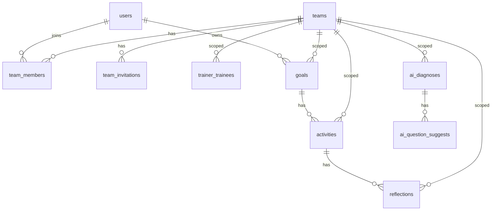

# Hisoka マルチテナント化 設計書

[saas-multitenant-plan.md](./saas-multitenant-plan.md) の方針に沿って、実装に落とせる粒度まで詳細化した設計書。
スコープは Phase 1（マルチテナント基盤、課金なし）+ Phase 2（SuperAdmin）まで。

---

## 0. スコープと前提

### 含むもの
- `teams` を中心としたマルチテナント DB スキーマ
- RLS のテナント境界による全面書き直し
- **SuperAdmin による「新チーム発行 + 初代 admin 招待」フロー**（チームの作成口は SuperAdmin のみ）
- チーム admin による trainer / trainee 招待フロー（既存 `inviteUser` の置換）
- SuperAdmin（運営）ダッシュボード
- 既存データの移行（default チームに集約）

### 含まないもの
- 課金 / Stripe 連携
- 監査ログ
- カスタムドメイン / SSO
- **セルフサインアップ**（一般ユーザーが自分でアカウントを作る経路は提供しない）

### 含むもの（複数チーム所属関連、明示）
- 1ユーザーが複数チームに所属できる（同一メールアドレスでチームA/Bの両方）
- チームごとに異なるロールを持てる（例: TeamA では trainer、TeamB では trainee）
- URL ベースのチームスコープ（`/t/<slug>/...`）
- ヘッダーのチーム切替ドロップダウン
- ログイン直後の「直近使ったチーム」自動選択 + 「所属チーム一覧」画面

### 前提となる確定事項（仮）
本設計書は以下を **既定** として進める。要レビュー:
- **(D-1) URL方式**: **テナントを URL に含める** (`/t/<slug>/dashboard` 形式)。複数チーム所属を扱うため、現在どのチームを見ているかを URL で常に明示する。
- **(D-2) 複数チーム所属**: **完全サポート**。同一ユーザーが複数チームに所属でき、チームごとに異なるロールを持てる。チーム切替UIあり。
- **(D-3) SuperAdmin**: `users.is_super_admin BOOLEAN` フラグで実装（別テーブル化はしない）。
- **(D-4) チーム作成の入口**: **SuperAdmin のみ**。一般ユーザー向けセルフサインアップは提供しない。チーム発行は「チーム作成 + 初代 admin の招待メール送信」を1アクションで実行する。
- **(D-5) チーム admin の追加**: 通常運用では SuperAdmin が招待。チーム admin 自身は trainer/trainee のみ招待可能（admin role の選択肢は出さない）。
- **(D-6) 招待受諾とユーザー識別**: 招待は `email` で行うが、受諾時に同じ `auth.users` に対して別チームの `team_members` を追加する。既存ユーザーが別チームに招待された場合、ログインすればそのまま受諾でき、新しい認証アカウントは作らない。

---

## 1. データモデル詳細

### 1.1 ER図（Mermaid）


### 1.2 新規テーブル

#### `teams`
| カラム | 型 | 制約/デフォルト | 説明 |
|---|---|---|---|
| id | UUID | PK, default gen_random_uuid() | |
| name | VARCHAR(100) | NOT NULL | 表示名 |
| slug | VARCHAR(60) | UNIQUE, NOT NULL | 予約語禁止リストでバリデーション |
| plan | VARCHAR(20) | NOT NULL, default 'free' | 'free'/'starter'/'pro' |
| max_members | INTEGER | NOT NULL, default 5 | プランに応じた上限 |
| status | VARCHAR(20) | NOT NULL, default 'active' | 'active'/'suspended'/'cancelled' |
| trial_ends_at | TIMESTAMPTZ | NULL | NULLなら無期限（MVP） |
| created_at | TIMESTAMPTZ | default now() | |
| updated_at | TIMESTAMPTZ | default now() | |

**slug 予約語**: `admin`, `super-admin`, `api`, `auth`, `login`, `signup`, `dashboard`, `t`

#### `team_members`
| カラム | 型 | 制約 | 説明 |
|---|---|---|---|
| id | UUID | PK | |
| team_id | UUID | FK→teams.id ON DELETE CASCADE | |
| user_id | UUID | FK→users.id ON DELETE CASCADE | |
| role | VARCHAR(20) | CHECK in ('admin','trainer','trainee') | チーム内ロール |
| status | VARCHAR(20) | CHECK in ('active','invited','disabled'), default 'active' | |
| joined_at | TIMESTAMPTZ | default now() | |
| UNIQUE | (team_id, user_id) | | |

#### `team_invitations`
| カラム | 型 | 制約 | 説明 |
|---|---|---|---|
| id | UUID | PK | |
| team_id | UUID | FK→teams.id ON DELETE CASCADE | |
| email | TEXT | NOT NULL | 小文字正規化 |
| role | VARCHAR(20) | CHECK | 招待時のロール |
| invited_by | UUID | FK→users.id | 招待元 |
| token | TEXT | UNIQUE, NOT NULL | crypto-random 32byte hex |
| expires_at | TIMESTAMPTZ | NOT NULL | 招待時+7日 |
| accepted_at | TIMESTAMPTZ | NULL | |
| created_at | TIMESTAMPTZ | default now() | |
| UNIQUE | (team_id, email) | | 同一チームに重複招待しない |

### 1.3 既存テーブルの改修

#### `users`
- `role_id UUID` を **削除**
- `is_super_admin BOOLEAN NOT NULL DEFAULT FALSE` を追加

#### 業務テーブル（全部に `team_id UUID NOT NULL REFERENCES teams(id) ON DELETE CASCADE` を追加）
- `trainer_trainees`
- `goals`
- `activities`
- `reflections`
- `ai_diagnoses`
- `ai_question_suggests` は `ai_diagnoses` から導出可能なので追加しない

#### 整合性トリガ
`activities.team_id` は `goals.team_id` と一致する必要あり。INSERT/UPDATE 時に親 `team_id` を自動コピーするトリガを設置:
```sql
CREATE OR REPLACE FUNCTION public.copy_team_id_from_goal()
RETURNS TRIGGER LANGUAGE plpgsql AS $$
BEGIN
  SELECT team_id INTO NEW.team_id FROM goals WHERE id = NEW.goal_id;
  RETURN NEW;
END;
$$;
CREATE TRIGGER trg_activities_team_id BEFORE INSERT ON activities
  FOR EACH ROW EXECUTE FUNCTION public.copy_team_id_from_goal();
```
同様に `reflections` は `activities` から、`ai_diagnoses` は `users` の **現在所属チーム** から（複数所属時は呼び出し側で明示）。

### 1.4 廃止
- `roles` テーブル: 業務テーブルから参照されなくなり次第 DROP。

---

## 2. SQL 関数（RLS用）

```sql
-- 現在ログイン中のユーザーが active メンバーであるチームID集合
CREATE OR REPLACE FUNCTION public.current_team_ids() RETURNS SETOF UUID
LANGUAGE sql SECURITY DEFINER SET search_path = public AS $$
  SELECT team_id FROM team_members
   WHERE user_id = auth.uid() AND status = 'active';
$$;

-- 指定チーム内で admin か
CREATE OR REPLACE FUNCTION public.is_team_admin(p_team UUID) RETURNS boolean
LANGUAGE sql SECURITY DEFINER SET search_path = public AS $$
  SELECT EXISTS (
    SELECT 1 FROM team_members
     WHERE user_id = auth.uid() AND team_id = p_team
       AND role = 'admin' AND status = 'active'
  );
$$;

-- 指定トレーニーを担当するトレーナーか（チーム内）
CREATE OR REPLACE FUNCTION public.is_trainer_of_in_team(
  p_trainee UUID, p_team UUID
) RETURNS boolean
LANGUAGE sql SECURITY DEFINER SET search_path = public AS $$
  SELECT EXISTS (
    SELECT 1 FROM trainer_trainees
     WHERE trainer_id = auth.uid()
       AND trainee_id = p_trainee
       AND team_id = p_team
  );
$$;

CREATE OR REPLACE FUNCTION public.is_super_admin() RETURNS boolean
LANGUAGE sql SECURITY DEFINER SET search_path = public AS $$
  SELECT COALESCE((SELECT is_super_admin FROM users WHERE id = auth.uid()), false);
$$;
```

---

## 3. RLS ポリシー設計

各テーブル共通テンプレ:
```sql
USING (
  public.is_super_admin()
  OR (
    team_id IN (SELECT public.current_team_ids())
    AND (
      user_id = auth.uid()
      OR public.is_team_admin(team_id)
      OR public.is_trainer_of_in_team(user_id, team_id)
    )
  )
)
```

INSERT は `WITH CHECK` に **「team_id が自分の所属チームのいずれか」** を必須化。

`team_members` 自体のポリシー:
- SELECT: 同チームメンバーは見える
- INSERT/UPDATE/DELETE: チーム admin or SuperAdmin

`team_invitations`:
- SELECT: チーム admin
- INSERT: チーム admin
- DELETE: チーム admin（取り消し）
- 招待トークン照合は **service role 経由**（RLS 迂回）で実装

---

## 4. アプリケーション設計

### 4.1 ディレクトリ構成（追加分）
URL構造:
- 業務画面はすべて `/t/<slug>/...` 配下に移動
- `/teams` は所属チーム選択画面（複数所属時のハブ）
- `/super-admin` と `/invitations` と `/login` 等はチームスコープ外

```
app/
  t/[slug]/                   # チームスコープ。Layout で slug→team_id 解決
    layout.tsx                # メンバーシップ検証 + currentTeamSlug を context に
    dashboard/page.tsx
    goals/...                 # 既存 (main) 配下を引っ越し
    activities/...
    reflections/...
    admin/                    # 既存 (admin)/admin から引っ越し（チーム admin用）
      users/page.tsx
      trainers/page.tsx
      assignments/page.tsx
    trainer/                  # 既存 (trainer) から引っ越し
  teams/page.tsx              # 所属チーム一覧（ハブ）
  (super)/super-admin/        # 新設。SuperAdmin 専用（チームスコープ外）
    layout.tsx
    page.tsx
    teams/new/page.tsx
    teams/[id]/page.tsx
  invitations/[token]/page.tsx # 招待受諾画面
  no-team/page.tsx             # 1チームも所属なし & SuperAdmin でもないユーザー向け
lib/
  actions/
    teams.ts                  # チーム関連（自分の所属一覧など）
    invitations.ts
    super-admin.ts
  context/
    current-team.ts           # slug→team の解決とメンバーシップ検証
middleware.ts                  # /t/<slug> のメンバーシップ検証ガード
```

> 既存の `app/(main)` / `app/(admin)/admin` / `app/(trainer)` を `/t/[slug]/...` 配下に **物理的に移動** する。差分は大きいが、URL でのチームスコープを徹底するためここを妥協しない。

### 4.2 currentTeam の解決（URL ドリブン）
方針: **URL の `slug` を唯一の真実とし、cookie はあくまで「直近どのチームを開いていたか」のヒント**。

- `app/t/[slug]/layout.tsx` で:
  1. `slug` から `teams` を引く
  2. ログイン中ユーザーがそのチームの **active な team_member** であることを検証
  3. NG なら 404
  4. OK なら React Context (`CurrentTeamProvider`) に `{ teamId, slug, role }` をセット
  5. cookie `hisoka_last_team` に slug を保存（次回ログイン時の自動遷移用）

- すべての Server Action は `teamId`(またはslug) を **第1引数で受け取る**:
  ```ts
  export async function createGoal(teamSlug: string, input: ...) {
    const { teamId, role } = await resolveTeamFromSlug(teamSlug); // メンバーシップ検証込み
    // INSERT で team_id: teamId を注入
  }
  ```
  → cookie ベースの暗黙的な currentTeam を **持たない**（マルチタブで別チームを並行操作できる）

- ログイン直後の遷移ロジック（`/login` の Server Action 内）:
  1. `team_members` で active な所属を取得
  2. 0件 → `/no-team`
  3. 1件 → `/t/<その唯一のslug>/dashboard`
  4. 2件以上 → cookie `hisoka_last_team` があり、かつ現在も所属していればそこへ。なければ `/teams` 選択画面へ

- `/teams` 画面: 所属チーム一覧をカード表示し、クリックで `/t/<slug>/dashboard` へ。SuperAdmin の場合は「Super Admin ダッシュボードへ」リンクも表示。

### 4.3 SuperAdmin によるチーム発行 + 初代 admin 招待
セルフサインアップは **提供しない**。チームの新規作成口は **SuperAdmin の管理画面のみ**。

フロー:
1. SuperAdmin が `/super-admin/teams/new` で「チーム名」「初代 admin の email」「氏名」「プラン」を入力
2. Server Action `provisionTeam(input)` が以下を **1トランザクション** で実行:
   - `teams` INSERT
   - `team_invitations` に role='admin' のレコード INSERT（token 発行）
   - `supabase.auth.admin.inviteUserByEmail(email, { redirectTo: '/invitations/<token>' })` で招待メール送信
3. 初代 admin が招待メールから受諾 → `team_members(role='admin', status='active')` が作られる
4. 以降、その admin が trainer / trainee を招待できる

Postgres 関数（service role 経由で呼ぶ）:
```sql
CREATE OR REPLACE FUNCTION public.provision_team(
  p_team_name TEXT, p_team_slug TEXT, p_plan TEXT,
  p_admin_email TEXT, p_admin_name TEXT,
  p_invited_by UUID, p_token TEXT, p_expires_at TIMESTAMPTZ
) RETURNS UUID
LANGUAGE plpgsql SECURITY DEFINER SET search_path = public AS $$
DECLARE v_team UUID;
BEGIN
  IF public.is_reserved_slug(p_team_slug) THEN
    RAISE EXCEPTION 'reserved slug: %', p_team_slug;
  END IF;

  INSERT INTO teams (name, slug, plan)
    VALUES (p_team_name, p_team_slug, COALESCE(p_plan, 'free'))
    RETURNING id INTO v_team;

  INSERT INTO team_invitations (team_id, email, role, invited_by, token, expires_at)
    VALUES (v_team, lower(p_admin_email), 'admin', p_invited_by, p_token, p_expires_at);

  RETURN v_team;
END;
$$;
```

> 招待メール送信は Postgres から行えないので、Server Action 側で「rpc → 戻り値の team_id を受けて inviteUserByEmail」の順で2ステップになる。`inviteUserByEmail` が失敗した場合は同 Action 内で `team_invitations` を DELETE してロールバック扱い。

### 4.4 招待フロー（trainer / trainee）
チーム admin が **同チーム内** に trainer / trainee を招待する経路。

1. **作成**: チーム admin が email + role を入力 → `inviteTeamMember(teamId, email, role)`:
   - admin 自身がそのチームの admin であることを Server Action 内で検証
   - `team_invitations` に token を発行して INSERT
   - `supabase.auth.admin.inviteUserByEmail(email, { redirectTo: \`/invitations/${token}\` })` で招待メール送信
2. **受諾**: §4.5 の共通受諾フローへ
3. **role='admin' は admin が招待できない**（admin の追加は SuperAdmin のみが行う設計とする。MVPの単純化のため）

### 4.5 招待受諾フロー（共通、複数所属対応）
SuperAdmin 発行の admin 招待も、admin 発行の trainer/trainee 招待も、受諾は同じ画面で扱う。
**既存ユーザーが別チームに招待された場合も、新しい認証アカウントを作らず同一 `auth.users` に `team_members` を1行追加するだけ**。

ケースA: **未登録メアドへの招待**
1. ユーザーがメール内リンクをクリック → Supabase の `inviteUserByEmail` 標準フローで `auth.users` が作られ、パスワード未設定状態でセッション確立
2. `/auth/callback` 経由で `/invitations/[token]` へ
3. サーバーで token 検証 → users upsert + team_members INSERT + accepted_at 更新
4. パスワード未設定なら `/auth/set-password` へ誘導 → 設定後 `/t/<slug>/dashboard`

ケースB: **既存ユーザーが別チームへ招待された**
1. ユーザーが既にログイン済みの状態で招待リンクをクリック
   - **この時、既存セッションのユーザーの `auth.users.email` が招待先 email と一致するか確認**
   - 一致しない場合は「別アカウントでログインしてください」エラー画面（`/auth/callback` で signOut して `/login?next=/invitations/[token]` へ誘導）
2. 一致する場合:
   - team_members INSERT（既存所属はそのまま、新チームの行が追加されるだけ）
   - accepted_at 更新
   - cookie `hisoka_last_team` を新チームに切替 → `/t/<新slug>/dashboard`
3. ログインしていなければ `/login?next=/invitations/[token]` へ。ログイン後に同じトークンを使って受諾

サーバー側 token 検証（共通）:
- `expires_at` 未経過
- `accepted_at IS NULL`
- 現在ログイン中ユーザーの `auth.users.email` と `team_invitations.email` が一致（大文字小文字無視）
- 同じ team に既に active で所属している場合はエラー（重複防止）

NG（期限切れ/email 不一致/重複所属）は専用エラー画面へ

### 4.6 SuperAdmin 機能
- `users.is_super_admin = true` のユーザーは `/super-admin` にアクセス可能
- 機能:
  - **テナント一覧**（メンバー数、plan、status、created_at）
  - **テナント発行フォーム**（チーム名、slug、plan、初代 admin の email/氏名）→ `provisionTeam` 実行
  - **テナント詳細**（メンバー一覧、status 切替、再招待、admin 追加招待）
- 初期 SuperAdmin は **手動で SQL 実行** で立てる（運用手順をREADMEに）

### 4.7 ガード（middleware.ts）
- 未認証 → 既存通り `/login`
- 認証済み + 所属チーム0件 + SuperAdminでもない → **`/no-team`**
- 認証済みで `/`（ルート）アクセス時 → §4.2 のログイン直後遷移ロジックを再実行
- `/t/<slug>/*` → middleware ではセッション確認のみ。**所属チェックは layout.tsx で実施**（slug→team_id 解決が必要なため middleware では重い）
- `/t/<slug>/admin/*` → layout で role='admin' チェック
- `/t/<slug>/trainer/*` → layout で role='trainer'(or admin) チェック
- `/super-admin/*` → SuperAdmin 以外は 404
- `/teams` → 認証済みなら誰でもアクセス可（自分の所属一覧を見るだけ）
- **`/signup` ルートは存在させない**（404）

### 4.8 既存 Server Action の改修
全 Action を **「第1引数で teamSlug を必須」** に変更し、内部で `resolveTeamFromSlug(teamSlug)` を呼んでメンバーシップ検証してから処理する。

| ファイル | 変更点 |
|---|---|
| [lib/actions/auth.ts](../lib/actions/auth.ts) | サインアップ系は追加しない。ログイン後遷移ロジックを §4.2 に合わせる |
| [lib/actions/admin.ts](../lib/actions/admin.ts) | `inviteUser` を撤去 → `lib/actions/invitations.ts` の `inviteTeamMember` に置換。残り Action は teamSlug を受ける |
| [lib/actions/goals.ts](../lib/actions/goals.ts) | 全 Action の第1引数に teamSlug。INSERT 時 team_id を注入 |
| [lib/actions/activities.ts](../lib/actions/activities.ts) | 同上（DBトリガで team_id 自動コピーされるので明示不要だがコメントで明記） |
| [lib/actions/reflections.ts](../lib/actions/reflections.ts) | 同上 |
| [lib/actions/ai.ts](../lib/actions/ai.ts) | 同上、team_id 明示 |
| `lib/actions/teams.ts` (新規) | `listMyTeams()`, `setLastTeam(slug)` |
| `lib/actions/super-admin.ts` (新規) | `provisionTeam`, `listTeams`, `getTeamDetail`, `updateTeamStatus`, `toggleSuperAdmin`, `inviteAdditionalAdmin` |
| `lib/actions/invitations.ts` (新規) | `inviteTeamMember(teamSlug,...)`, `acceptInvitation(token)`, `revokeInvitation(invitationId)` |

---

## 5. データ移行手順

### 5.1 マイグレーションファイル分割
1. `20260501_a_add_teams.sql`
   - `teams`, `team_members`, `team_invitations` 作成
   - 業務テーブルに `team_id` を NULLABLE で追加
   - 関数とトリガ追加（新版）
   - `users.is_super_admin` 追加
2. `20260501_b_backfill.sql`
   - default チームを1件作成
   - 既存全 `users` を `team_members` に挿入（`roles.name` を `team_members.role` にコピー）
   - 全業務テーブルの `team_id` を default チームのIDで埋める
3. `20260501_c_drop_legacy.sql`
   - 業務テーブルの `team_id` を `NOT NULL` 化
   - 旧 RLS ポリシー drop → 新ポリシー create
   - `users.role_id` カラム削除
   - 旧関数 `is_admin()` / `is_trainer_of()` を新版で置換
   - `roles` テーブル DROP

### 5.2 ロールバック戦略
- 各マイグレに対応する `*_revert.sql` を用意
- ステージングで a→b→c の順に適用 → スモークテスト → revert で戻せることを確認してから本番へ

---

## 6. テスト戦略

### 6.1 RLS テスト（最重要）
Supabase の `auth.jwt()` を擬似的にセットしたユニットテストを `scripts/rls-test.mjs` として作成し、以下を検証:
- 別チームの admin でログインしても他チームの `goals` が見えない
- 同チームの trainer は担当 trainee の `goals` のみ見える
- SuperAdmin は全部見える
- 招待中 (status='invited') のメンバーは現在のチームに含まれない

### 6.2 移行テスト
本番 DB のスナップショットをステージングにリストアし、a→b→c を流して既存ユーザーがそのままログインできることを確認。

### 6.3 招待フロー手動テスト
- 新チーム作成 → trainer 招待 → メール受領 → 受諾 → ログイン → ダッシュボード表示
- 期限切れトークンで 4xx
- 別ユーザーでログイン中にトークンを踏んだ時の挙動

---

## 7. 環境変数追加
- `NEXT_PUBLIC_SITE_URL`: 招待メールのリンク生成（既に [lib/actions/admin.ts:55-59](../lib/actions/admin.ts#L55-L59) で参照中）
- 追加なし（Stripe等は今回スコープ外）

---

## 8. ロールアウト手順
1. 本設計書をレビュー → D-1〜D-3 を確定
2. ステージング DB に a→b→c を適用、RLSテスト実行
3. アプリコード（Server Actions / 招待 / サインアップ / ガード）を順次マージ
4. ステージングで E2E 手動テスト
5. メンテ告知 → 本番 DB へ a→b→c → アプリデプロイ
6. SuperAdmin 初期ユーザーを SQL で立てる
7. 動作確認 → メンテ解除
